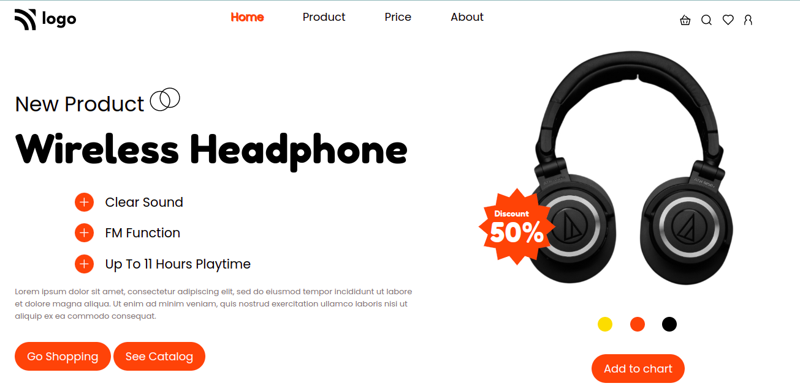

# Product landing page

- This is my **seventh** project.

- This project is a website of a headphone brand. This website is designed using pure HTML and CSS. I have made this site fully responsive and this is my first responsive site.

- It took me 3-4hr to make this project.

---

## Breakpoints

- I have taken **Two** breakpoints to make this site responsive.
  - First at **912px**
  - Second at **600px**

## Screenshot

---

## 🛠 Skills learned

HTML, CSS, to make responsive site

---

## 🚀 About Me

### Hey, I am Yasir lambawala

- I am born and brought up in Vadodara, Gujarat. I have done my Btech at GTU university and I am currently learning Web-development.

---

## Feedback

- If you have any feedback, please reach me at lambawalay@gmail.com
